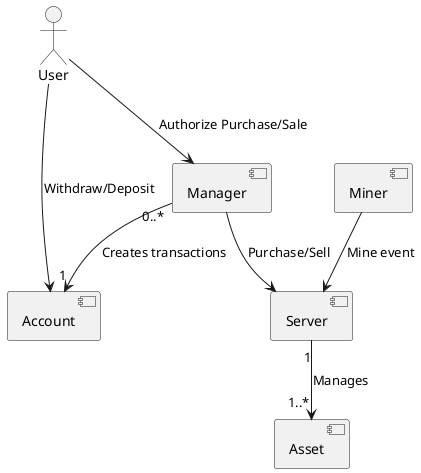
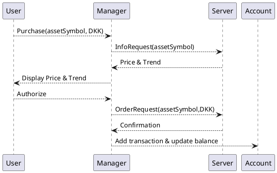

# Exchange system

| 202307397 | Ali Najafi |
| --------- | ---------- |
| 202207320 | Avantika   |
| 202500766 | Adriana    |

## SWAPK

To compile the application in the golden image

```bash
g++ -std=c++23 -I./include -I./include/exchange main.cpp src/exchange/*.cpp src/exchange/asset/*.cpp -lpthread -o exchange
```

## Introduction

The asset exchange system is a trading platform, allowing a user to buy and sell assets of different type. The goal of this project is to incoporate as many concepts learned in the course in a way that utilizeses each concepts strengths.

## Requirements

User perspective requirements:

- Withdrawing and depositting money, viewing transaction history and current balance
- Purchasing and selling assets of different types ( stock and crypto )
- Viewing portfolio stats
- Configuring stop loss limit rules, which allows the user to setup rules to automatically sell an asset if it goes below a certain price.

System perspective requirements:

- One server-node per asset type
- Server observability
- Simulating asset price changes
- The crypto server should handle events from crypto miners when they mine crypto

## Architecture

Managers are associated with an account, so they can get money to purchase, and put money after a sale.
Multiple manager can use the same account.
The server is the source of truth for asset prices.



## Design

Managers and Miners can communicate with the server-nodes.
Each server-node has a message queue, where it can receive the following types of messages:

### Messages

| Message | Parameters | Response |
| ------------- | -------------- | -------------- |
|InfoRequest | asset symbols(e.g. BTC) | Trend and current price for each asset |
|OrderRequest| asset symbol, type(sale/purchase), quantity in money|Confirmation of order
| MineEvent| crypto, quantity, miner id |None
| Stop(graceful shutdown)| None| None

Miners mine for crypto currencies, and when they succesfully mine a quantity of a crypto, then they emit events, which the server uses to adjust the total quantity of a crypto, and adjust the unit price.

#### Request flow for placing an order



# Implementation

### Asset classes (Stock & Crypto)

Many classes throughout the system is template and accepts a Asset class as template. These classes store a vector of unit prices over time.
Additionally the Asset classes uses boost signals2, whenever a new price is added by the server, then the signal is triggered.

### Message Queue

The Message Queue class is the primary interface to the server, its a template class which requires an Asset class as template type. For the message queue we define the types of messages it can accept based on the template type

```cpp
template <typename T> using Message = trait::MessageQueue<T>::Variant;
```

With the use of traits we can define which messages are possible based on the asset type, this is a fixed trait

```cpp
template <typename T> class MessageQueue;
template <> struct MessageQueue<asset::Stock> {
  using Variant = std::variant<OrderRequest, InfoRequest, Stop>;
  static int QueueCapacity() { return 100; }
};
```

We use std::variant to be able to define a set of types, this allows the queue to store the variant as queue elements, and based on the template asset type the set of messages can change. Overall this makes the queue very flexible.
Additionally there is a value trait, the QueueCapacity(), based on asset type different capacity is required.
The queue is essentially the interface between a server thread and client threads. Therefore protection and synchronization mechanisms is important.

- If a thread pushes to a full queue, then it should block until there is space again.
- If a thread tries to pop a message, and the queue is empty, then it should be blocked until there is a message in the queue.

To achieve this we use a mutex and 2 condition variables

```cpp
  void push(message::Message<T> &&msg) {
    std::unique_lock<std::mutex> lock(mtx);
    cv_not_full.wait(lock, [this] { return queue.size() < maxSize; });
    queue.push(std::move(msg));
    cv_not_empty.notify_one();
  }
```

The push method on the queue, first aquires locks, then it waits on the condition variable

- if the current queue size is less than the max size, then the thread procceds and pushes the msg, since there is space in the queue.
- else the thread will go to sleep, and when the server thread pops from the queue, it will signal the condition variable cv_not_full, because the queue is not full anymore, the thread wakes up and checks the condition and then procceds to push the msg to the queue.

Finally the cv_not_empty condition variable is notified, so if the server thread is sleeping because the queue is empty then it will wake up and check if the queue is not empty

## Server

The server is a template and accepts a type T which should be a asset type.
The server operates 2 threads:

#### Simulator thread

This thread regurlary iterates through assets, for each asset then generates a new price, within a percentage range of the current, and adds it to the assets unit price vector. Finally it triggers the assets signal, because the price changed.

#### Message proccesor thread

Below is the thread function.

```cpp
  void startMessageProccesor() {
    while (run_) {
      auto msg = msgQueue_.pop();
      std::visit(MessageVisitor<T>{*this}, msg);
    }
  }
```

The thread pops from the message queue, and then we use visitation with the functor **MessageVisitor**, which has a function operator overload for each type in the variant.  

The functor is also templated, and requires a asset type, this is because of 2 reasons:

1. The crypto type, has an additional message(MineEvent), to handle this we defined a full specilization for the crypto type, this specilization has a operator overload for the MineEvent message

2. The opeartor overloads needs to access asset type traits to handle messages, below is the InfoRequest operator overload(simplified). Based on the type of the asset, then the amount of data points to include for the trend calculation differs. To get the exact amount of datapoints to include in a trend calculation we use the LookBackPeriod() value trait.

```cpp
  void operator()(InfoRequest &i) {
    ...
    int lookBackPeriod = Trend<T>::LookBackPeriod();
    ...
    if (i.assetSymbols.size() * lookBackPeriod < 1000) {
      trends = CalculateTrends(serv.assets_, i.assetSymbols, sequential{});
    } else {
      trends = CalculateTrends(serv.assets_, i.assetSymbols, parallel{});
    }
    ...
```

Additionally we use **alghoritm selection using tagging**.

- If the data for trend calculation has a certain size, then its faster to do a parallel trend calculation, but too little and the thread overhead is not worth it.(this is not something we have timed)

Here is a snippet of the sequential implementation of **CalculateTrends**, which uses transform to apply the function to the Asset elements, and store the result in a map.

```cpp
  std::map<std::string, double> trends;
  std::transform(Assets.begin(), Assets.end(),
                 std::inserter(trends, trends.end()),
                 [&trends](const T *asset) {
                   double trend = CalculateTrends(asset);
                   return std::make_pair(asset->symbol, trend);
                 });
  return trends;
```

The server uses a custom OrderArray class to store orders in

```cpp
  OrderArray orders_;
  OrderArray ordersSnapshot_;
```

The simulator thread regurlary updates the snapshots, which can then be queryed without blocking the message proccesor thread. In the OrderArray class we implemented strong exception safety using the copy constructor and swap function.

```cpp
  OrderArray &operator=(const OrderArray &other) {
    OrderArray temp(other);
    Swap(temp);
    return *this;
  }
```

This ensures that in the case of an exception during copy assignment, then the existing snapshots will not be corrupted.

We use perfect forwarding for a factory function that constructs a Server

```cpp
template <typename T, typename... Args>
boost::shared_ptr<Server<T>> createServer(Args &&...args) {
  return boost::make_shared<Server<T>>(std::forward<Args>(args)...);
}
```

This will apply reference collapsing on prvalue, lvalue and xvalue.

## Observability

We made a custom logger for the server, which makes use of variadics, to accept a variable amount of arguments of type field.

```cpp
  template <typename T> struct field {
   std::string name;
   T value;
  };
```

This allows the including metadata when logging.
Not every type is loggable, so we defined concepts, this will improve the error messages during compilation if given a type not fulfilling the concept.

```cpp
                                                  //custom concept   
  template <typename T>                                   ↓
  concept isLoggable = (std::formattable<T, char> || toStringable<T>);
```

```cpp
  template <typename T, typename... Args>
  void log(std::string msg, level l, field<T> field, Args... args)
    requires isLoggable<T>
  {
    if constexpr (std::formattable<T, char>) {
      msg += std::format(", ({}:{})", field.name, field.value);
    } else {
      msg += std::format(", ({}:{})", field.name, field.value.toString());
    }
    log(msg, l, args...);
  }
```

Each recursive call handles one field, and appends it to the msg, and then makes a recursive call. The end marker then takes this final message and prepends the log level and a timestamp to it, and writes to a file. We also use compile-time-if, this allows the compiler to evaluate the condition at compile time and remove the not taken path.

The Logger uses FILE pointer to write the logs to a file, this is a special resource that cant be copied, therefore we deleted the copy constructor and copy assignment operator, if copied then it could lead to double freeing the FILE pointer which can crash the program. This triggers the **RULE OF 5** so we also implemented move semantics, which allows ownership change of FILE pointer.

We made a custom memory resource, called MonitorResource, this is used by the server and assets, and its used to monitor memory usage of the unit price vectors, specifically the bytes allocated as part of system health logs

```cpp
        logger_.log(
            "system health", util::observability::level::INFO,
            util::observability::field("bytes", ms_->getbytesalloc()),
            util::observability::field{"queue-load", msgQueue_.getQueueLoad()});
```

Its a man in the middle, and does not alter how allocation and deallocation is done for the unit price vectors.

## Manager

The manager communicates with the server through the message queue, it does not have its own message queue, instead it uses std::promise, some messages have a promise field, which the manager gets a future for before pushing the message to the server message queue. Then the manager waits for a response while also showing a terminal spinner to keep the UI active.

```cpp
    OrderRequest o{...};
    auto orderFut = o.prom.get_future();
    serv_->pushMsg(Message<T>(std::move(o)));

    while (orderFut.wait_for(100ms) != std::future_status::ready) {
      util::spin("waiting for server to process sale order");
    }
```

The use of promise allows the server thread to transfer the response data to the manager thread(main thread)

To implement stop loss rules we used boost signals.

The manager defines a slot as a member function, with the following signature:

```cpp
  void onAssetUpdate(std::string symbol, currency::DKK updatedPrice) 
```

But it does not match the signal signature which is the following:

```cpp
boost::signals2::signal<void(currency::DKK UpdatedPrice)>
```

The symbol is not included when the signal is called, the signal does not want to include the symbol everytime its called, a subscriber should know the symbol they subscribed to. But the manager can configure a price update for each of the owned assets it manages, and uses the same member function for all rules, therefore it needs a symbol param to distinguish. To handle this mismatch in signature we use std::bind

```cpp
  void addStopLossRule(std::string symbol, DKK limit) {
    ...
    auto handler = std::bind(&Manager<T>::onAssetUpdate, this, symbol, _1);
    auto conn = serv_->subscribeToPriceUpdates(symbol, handler);
    ...
  }
```

When adding a stop loss limit for an asset, then we can pass the symbol as the first parameter of onAssetUpdate, and then the argument the signal is called with is given as the second argument.

# Conclusion

The purpose of this system was to allow us to make use of the concepts taught in the course SWAPK, throughout working on the system we constantly tried to come up with features, that would allow us to make use of as many concepts in a way that utilized the strength of these concepts.
