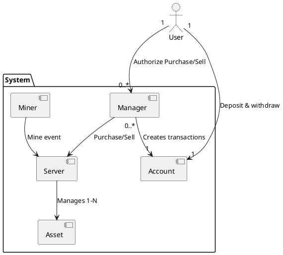
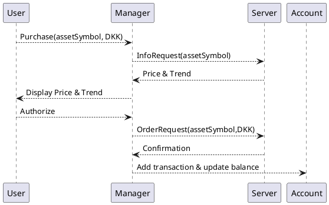

# Exchange system

| 202307397 | Ali Najafi |
| --------- | ---------- |
| 202207320 | Avantika   |
|           | Adriana    |

## SWAPK

# Introduction

This report describes our chosen project, the asset exchange system for SWAPK which is implemented using the C++ concepts learned throughout the course. The system functions as a multi-threaded trading platform, simulating asset prices, processing asynchronous buy and sell, managing user portfolios and maintaing detailed transaction history.

The primary goal of the project is to demonstrate how the C++ concepts taught in SWAPK can be used.

# Requirements

User perspective requirements:

- Withdrawing and depositting money in DKK currency, viewing transaction history and current balance
- Purchasing and selling assets of different types ( stock and crypto )
- Viewing portfolio stats, such as the portolfio value and trend
- Configuring stop loss limit rules, which allows the user to setup rules to automatically sell an asset if it goes below a certain price.

System perspective requirements:

- One server-node per asset type
- Server observability in the form of logs and metrics
- Simulating asset price changes
- The crypto server should handle events from crypto miners when they mine crypto

# Architecture

A user is the person using the application. A user can have one manager for each asset type. So one Crypto Manager and one Stock Manager per user. Managers are associated with an account, which is where they will get money to purchase, and put money after a sale.
A stock manager and crypto manager can use the same account.
The server is the source of truth for asset prices, managers does not store asset prices.



# Design

Managers and Miners can communicate with the server-nodes.
Each server-node has a message queue, where it can receive the following types of messages:

### Messages

#### InfoRequest

A manager can request information about a collection of assets, this is used for displaying portfolio stats and to display information about an asset to the user before the user authorizes the purchase or sale.

**Parameters**:

- Collection of asset symbols(e.g. BTC)

**Response**:

- Trend and current price for each asset

#### OrderRequest

If authorized by the user, then a manager places an order, which the server needs to confirm

**Parameters**:

- One asset symbol
- Type(either sale or purchase)
- Quantity in DKK

**Response**:

- Confirmation of order

#### MineEvent

Miners mine for crypto currencies, and when they succesfully mine a quantity of a crypto, then they emit events, which the server uses to adjust the total quantity of a crypto, for example there is around 19 million bitcoins, and if someone mines 100 bitcoins, then the server needs to know so it can update the total quantity and adjust the unit price.

**Parameters**:

**Response**:

#### Stop

The server can receive a stop message, which triggers graceful shutdown, allowing it to finish any ongoing requests.

### Request flow for placing an order



The account class stores a collection of transactions, a transaction can have one of the following types:

- withdraw
- deposit
- asset purchase
- asset sale

# Implementation

## Asset classes

The asset classes consist of 2 classes:

- Stock
- Crypto

These classes store a vector of unit prices over time, the back of the vector is the latest price.
Additionally the Asset classes uses boost signals2, whenever a new price is added by the server, then the signal is triggered.

```cpp
typedef boost::signals2::signal<void(currency::DKK UpdatedPrice)> UpdateSignal;
```

## Message Queue

The Message Queue class is the primary interface to the server, its a template class which requires a Asset class as template type.
For the message queue we define the types of messages it can accept based on the template type

```cpp
template <typename T> using Message = exchange::trait::MessageQueue<T>::Variant;
```

With the use of traits we can define which messages are possible based on the asset type, this is a fixed trait

```cpp
template <typename T> class MessageQueue;

template <> struct MessageQueue<asset::Stock> {
  using Variant = std::variant<OrderRequest, InfoRequest, Stop>;
  static int QueueCapacity() { return 100; }
};

template <> struct MessageQueue<asset::Crypto> {
  using Variant = std::variant<OrderRequest, InfoRequest, Stop, MineEvent>;
  static int QueueCapacity() { return 80; }
};
```

We use std::variant to be able to define a set of types, this allows the queue to store the variant as queue elements, and based on the template asset type the set of messages can change. Overall this makes the queue very flexible.
Here we can see that the Crypto type has the additional MineEvent message type.

Additionally there is a value trait, the QueueCapacity() adds value information, based on the type of asset the server has different traffic, and requires the queue to have a certain capacity.

The queue is essentially the interface between a server thread and client threads. Therefore protection and synchronization mechanisms is important.

- If a message producer tries to push a message to a full queue, then it should block the thread until there is space in the queue again.
- If the server thread tries to pop a message, and the queue is empty, then it should be blocked until there is a message in the queue.

// NOTE husk at initalisere queue med queuecapacity

To achieve this we use a mutex and 2 condition variables

```cpp
  void push(message::Message<T> &&msg) {
    std::unique_lock<std::mutex> lock(mtx);
    cv_not_full.wait(lock, [this] { return queue.size() < maxSize; });
    queue.push(std::move(msg));
    cv_not_empty.notify_one();
  }
```

The push method on the queue, first aquires locks, then it waits on the condition variable

- if the current queue size is less than the max size, then the thread procceds and pushes the msg, since there is space in the queue.
- else the thread will go to sleep, and when the server thread pops from the queue, it will signal the condition variable cv_not_full, because the queue is not full anymore, the thread wakes up and checks the condition and then procceds to push the msg to the queue.

Finally the cv_not_empty condition variable is notified, so if the server thread is sleeping because the queue is empty then it will wake up and check if the queue is not empty

## Server

The server is a template and accepts a type T which should be a asset type.
The server is multi-threaded, it operates 2 threads:

#### Simulator thread

This thread regurlary iterates through assets, for each asset then generates a new price, within a percentage range of the current, and adds it to the assets unit price vector. Finally it triggers the assets signal, because the price changed.

#### Message proccesor thread

Below is the thread function.

```cpp
  void startMessageProccesor() {
    while (run_) {
      auto msg = msgQueue_.pop();
      std::visit(MessageVisitor<T>{*this}, msg);
    }
  }
```

The thread pops from the message queue, and then we use visitation with the functor **MessageVisitor**, which has a function operator overload for each type in the variant.  

The functor is also templated, and requires a asset type, this is because of 2 reasons:

1. The crypto type, has an additional message(MineEvent), to handle this we defined a full specilization for the crypto type, this specilization has a operator overload for the MineEvent message

2. The opeartor overloads needs to access asset type traits to handle messages, below is the InfoRequest operator overload(simplified). Based on the type of the asset, then the amount of data points to include for the trend calculation differs. To get the exact amount of datapoints to include in a trend calculation we use the LookBackPeriod() value trait.

The idea with lookBackPeriod is that crypto currencies move alot faster than stocks, in terms of datapoints, and therefore a trend calculation for cryptocurrencies requires a shorter lookback so it does not include too old datapoints, so that the trend calculation is useful in the curent moment. On the other hand a stock requires a longer lookBackPeriod since they move slower.

```cpp
  void operator()(InfoRequest &i) {
    std::map<std::string, double> trends;
    int lookBackPeriod = Trend<T>::LookBackPeriod();
    std::lock_guard<std::mutex> lock(serv.mtx_);

    if (i.assetSymbols.size() * lookBackPeriod < 1000) {
      trends = CalculateTrends(serv.assets_, i.assetSymbols, sequential{});
    } else {
      trends = CalculateTrends(serv.assets_, i.assetSymbols, parallel{});
    }
    ...
```

Additionally we use **alghoritm selection using tagging**.

- If the number of assets in the request multiplied with lookBackPeriod is a certain data load, then its faster to do a parallel trend calculation.
- If its less, then the overhead of spawning threads is not worth it and a sequential execution is faster.

Here is a snippet of the parallel implementation of **CalculateTrends**

```cpp
  std::vector<std::future<double>> futures;
  for (const auto &[symbol, asset] : assets) {
    auto it = std::find(ownedAssets.begin(), ownedAssets.end(), symbol);
    if (it != ownedAssets.end()) {
      futures.push_back(std::async(std::launch::async, [&asset]() {
        return calculateTrendForIndividualAsset<T>(asset);
      }));
    }
  }
```

We spawn a thread for each trend caclulation, using std::async, and store futures in a vector. The implementation does not query the cpu cores on the machine and distribute calculations among these, which would have been an improvement. If a request has a 50 elements, then spawning 50 threads is definitely not optimal in terms of speed.

```cpp
template <typename T> double calculateTrendForIndividualAsset(const T &asset) {
  typedef typename Precision<T>::PrecisionT PrecisionT;
  const auto &vec = asset.unitPriceOverTime_;
  if (vec.size() == 1) {
    return 0;
  }
  PrecisionT sumX = 0;
  PrecisionT sumY = 0;
  PrecisionT sumXY = 0;
  PrecisionT sumX2 = 0;
  if (trait::Trend<T>::LookBackPeriod() > vec.size()) {
    for (int i = 0; i < vec.size(); i++) {
      currency::DKK price = vec[i];
      sumX += i;
      sumY += price.value();
      sumXY += (i * price.value());
      sumX2 += (i * i);
    }
  ...
```

The **calculateTrendForIndividualAsset** is the function doing the actual calculation, here we use the PrecisionT fixed trait. The idea is that crypto requires larger decimal precision compared to stocks. Maybe a crypto has 18 decimals, while stock can have maximal 10. This also means that a crypto can have a money value which has alot of decimals, and therefore requires high precision when calculating the trend.

## observability

### Logger

We made a custom logger for the server. This logger writes to a file.
The logger makes use of variadics, to accept a variable amount of arguments of type field.

```cpp
  template <typename T> struct field {
   std::string name;
   T value;
  };
```

This allows the including metadata when logging.
Not every type is loggable, so we defined concepts, this will improve the error messages if someone passes a type which is not loggable.

```cpp
  template <typename T>
  concept toStringable = requires(T t) {
    { t.toString() } -> std::same_as<std::string>;
  };

  template <typename T>
  concept isLoggable = (std::formattable<T, char> || toStringable<T>);
```

Either a type needs to have a toString method or should be formattable.

```cpp
  template <typename T, typename... Args>
  void log(std::string msg, level l, field<T> field, Args... args)
    requires isLoggable<T>
  {
    if constexpr (std::formattable<T, char>) {
      msg += std::format(", ({}:{})", field.name, field.value);
    } else {
      msg += std::format(", ({}:{})", field.name, field.value.toString());
    }
    log(msg, l, args...);
  }
```

Each recursive call handles one field, and appends it to the msg, and then makes a recursive call. The end marker then takes this final message and prepends the log level and a timestamp to it, and writes to a file. We also use compile-time-if, this allows the compiler to evaluate the condition at compile time and remove the not taken path.

The Logger uses FILE pointer to write the logs to a file, this is a special resource that cant be copied, therefore we deleted the copy constructor and copy assignment operator, if copied then it could lead to double freeing the FILE pointer which can crash the program. This triggers the **RULE OF 5** so we also implemented move semantics, which allows ownership change of FILE pointer.

## Manager

The manager communicates with the server through the message queue, it does not have its own message queue, but it still needs a response from the server for these message types:

- InfoRequest
- OrderRequest
For this we use std::promise, both of the messages have a promise field, which the manager gets a future for before pushing the message to the server message queue. Then we wait for a response, while also showing a terminal spinner to keep the UI active.

```cpp
    OrderRequest o{...};
    auto orderFut = o.prom.get_future();
    serv_->pushMsg(Message<T>(std::move(o)));

    while (orderFut.wait_for(100ms) != std::future_status::ready) {
      util::spin("waiting for server to process sale order");
    }
```

The use of promise allows the server thread to transfer the response data to the manager thread(main thread)

Another feature was the user being able to configure stop loss rules for a owned asset automatically, meaning if a asset goes below a certain price, then it should automatically sell all of the asset to prevent further loss. For this we need the signals which was defined in the asset classes. The server provides a subscribe function that does not expose the signal to a client, this prevents a evil client for falsely triggering the signal.

```cpp
  // Server function
  boost::signals2::connection
  subscribeToPriceUpdates(std::string assetSymbol,
                          std::function<void(currency::DKK UpdatedPrice)> cb) {
    return assets_.at(assetSymbol).sig_->connect(cb);
  }
```

Here it accepts the asset symbol that a subscriber is interested in, and the callback to call when price updates. We use std::function for increased flexibility, now it can accept a functor, free function or member function callback.

The manager defines a slot as a member function, with the following signature:

```cpp
  void onAssetUpdate(std::string symbol, currency::DKK updatedPrice) 

```

But it does not match the signal signature which is the following:

```cpp
boost::signals2::signal<void(currency::DKK UpdatedPrice)>
```

The signal does not adapt to the managers handler signature, because it expects that a subscriber already knows which signal they are subscribing to, and not that they need to be reminded every price update. But the manager can configure a price update for each of the owned assets it manages, so it needs to know which asset is having a price update and compare against the stop loss limit, which is why is needs a parameter to tell it which asset symbol the price update is for. To handle this mismatch in signature we use std::bind

```cpp
  // Manager function
  void addStopLossRule(std::string symbol, DKK limit) {
    ...
    auto handler = std::bind(&Manager<T>::onAssetUpdate, this, symbol, _1);
    auto conn = serv_->subscribeToPriceUpdates(symbol, handler);
    ...
  }
```

When adding a stop loss limit for an asset, then we can pass the symbol as the first parameter of onAssetUpdate, and then the argument the signal is called with is given as the second argument for the onAssetUpdate handler, which allows the handler to know which asset the price update is for.

## PMR

## Meta Programming

# Conclusion

The purpose of this system was to allow us to make use of the concepts taught in the course SWAPK, throughout working on the system we constantly tried to come up with features, that would allow us to make use of as many concepts in a way that utilized the strength of these concepts.
