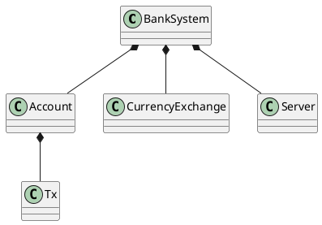

# Bank system

| 202307397 | Ali Najafi |
| --------- | ---------- |
| 202207320 | Avantika   |
|           | Adriana    |

## SWAPK

# Introduction

# System description
The banking system has four main features where each feature have set of requirements that needs to be fullfiled. 

#### Features

Feature 1: Account management 
This feature allows users to create accounts and also manage their account. 

Feature 2: Payment and transfer 
This feature enables user to deposit, withdraw and track transaction in their accounts. It also allows the user to view their transaction history and acoount balance. 

Feature 3: Investment management
This allows the user to manage their invesments, includign buying and selling stocks. 

Feature 4: Currency exchange 
This lets the user exchange between currency. 

#### Requirements

- F1.1: The system shall allow users to create an account. 

- F1.2: The system shall support to link one or more bank accounts 

- F2.1: The system shall have deposit funds into their account

- F2.2: The system shall allow users to withdraw funds from their account 

- F2.3: The system shall allow users to check the transaction history 

- F2.4: The system shall allow users to check their current balance. 

- F3.1: The system shall allow users to buy stocks

- F3.2: The system shall allow users to sell stocks

- F4.1: The system shall allow users to exchange from one currency to another. 

# Architecture
This is an overall class diagram which represents the main funtional components for the banking system and their relationships without showing the utility and helper classes such as logging and exception handling. The diagram shows that the system is designed for the user to one or multiple accounts, change betweeen currency and stocks. It illustrates the dependency of account on transaction. 

# Design
# Implementation
# Discussion
# Conclusion