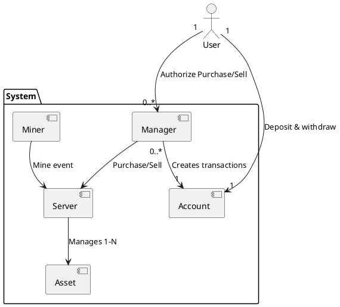
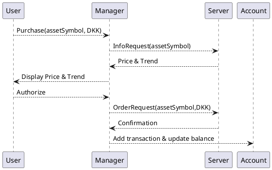

# Exchange system

| 202307397 | Ali Najafi |
| --------- | ---------- |
| 202207320 | Avantika   |
|           | Adriana    |

## SWAPK

# Introduction

This report describes our chosen project, the asset exchange system for SWAPK which is implemented using the C++ concepts learned throughout the course. The system functions as a multi-threaded trading platform, simulating asset prices, processing asynchronous buy and sell, managing user portfolios and maintaing detailed transaction history.

The primary goal of the project is to demonstrate how the C++ concepts taught in SWAPK can be used.

# Requirements

User perspective requirements:

- Withdrawing and depositting money in DKK currency, viewing transaction history and current balance
- Purchasing and selling assets of different types ( stock and crypto )
- Viewing portfolio stats, such as the portolfio value and trend
- Configuring stop loss limit rules, which allows the user to setup rules to automatically sell an asset if it goes below a certain price.

System perspective requirements:

- One server-node per asset type
- Server observability in the form of logs and metrics
- Simulating asset price changes
- The crypto server should handle events from crypto miners when they mine crypto

# Architecture

A user is the person using the application. A user can have one manager for each asset type. So one Crypto Manager and one Stock Manager per user. Managers are associated with an account, which is where they will get money to purchase, and put money after a sale.
A stock manager and crypto manager can use the same account.
The server is the source of truth for asset prices, managers does not store asset prices.

# Design

Managers and Miners can communicate with the server-nodes.
Each server-node has a message queue, where it can receive the following types of messages:

### Messages

#### InfoRequest

A manager can request information about a collection of assets, this is used for displaying portfolio stats and to display information about an asset to the user before the user authorizes the purchase or sale.

**Parameters**: Collection of asset symbols(e.g. BTC)

**Response**: Trend and current price for each asset

#### OrderRequest

If authorized by the user, then a manager places an order, which the server needs to confirm

**Parameters**: One asset symbol, type(either sale or purchase), quantity in DKK

**Response**: Confirmation of order

#### MineEvent

Miners mine for crypto currencies, and when they succesfully mine a quantity of a crypto, then they emit events, which the server uses to adjust the total quantity of a crypto, for example there is around 19 million bitcoins, and if someone mines 100 bitcoins, then the server needs to know so it can update the total quantity and adjust the unit price.

#### Stop

The server can receive a stop message, which triggers graceful shutdown, allowing it to finish any ongoing requests.

### Request flow for placing an order

The account class stores a collection of transactions, a transaction can have one of the following types:

- withdraw
- deposit
- asset purchase
- asset sale

# Implementation

## Event-driven server

To implement the event driven server, we defined a **MessageQueue** class with pop and push methods, this will ensure that pushing to a queue which is full blocks, and popping from and empty queue also blocks. This is achieved with condition variables and a mutex.
Then on the Server class we can define a special while loop, which pops from the **Message Queue** in each iteration and then dispatches the message to the **MessageVisitor** struct which has a overload for each type of message. Since the thread that pushes the message to the server is not even driven, we cant just push the response to a message queue. For this we use std::promise to set a response value.
Finally the Server also needs to publish when a asset price changes. For this we use boost::signals, each asset has its own signal, this allows the asset account for granular subscription.  
// add communication diagram here

Each asset has defined asset traits, here we defined a accumulator type, for example for crypto assets then having a high decimal precision is important, if we  just use a double then som decimals will be discarded which underestimates the value of a accounts assets, while a stock does not require the same precision.

## Account

The account

## Calculator/analyzer

When the server receives request to calculate trends it calls free functions defined in Calculator.h
These functions are template and takes a asset type,
Here we make use of alghoritm selection using tagging, depending on the amount of data that needs to proccesed we choose either a parallel or sequential calculation. The idea is that if the amount of data isnt very large then the overhead of spawning threads with std::async too large and doing it sequentially is faster.

## Logger

Each account has its own logger which logs to a file, which belongs to a account, The logger uses a **\*FILE**  pointer to write and read to files. The class uses RAII, when constructing the logger it aquires a file descriptor in the constructor and the destructor releases the file descriptor. This class has explicitly deleted the copy constructor and assignment operator, since we cant have 2 objects using the pointer, if one of the objects are destructed which closes the file descriptor and later the other object then tries write it will be an issue. Therefore we implemented the rule of 5, by implementing move semantics. now the FILE pointer can be moved from object to object.

## Meta programming

# Conclusion

