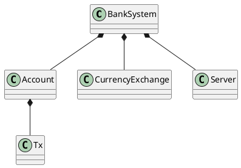
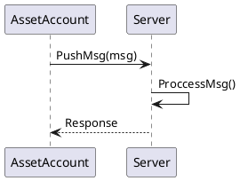

# Bank system

| 202307397 | Ali Najafi |
| --------- | ---------- |
| 202207320 | Avantika   |
|           | Adriana    |

## SWAPK

# Introduction

# System description
The banking system has four main features where each feature have set of requirements that needs to be fullfiled. 

#### Features

Feature 1: Account management 
This feature allows users to create accounts and also manage their account. 

Feature 2: Payment and transfer 
This feature enables user to deposit, withdraw and track transaction in their accounts. It also allows the user to view their transaction history and acoount balance. 

Feature 3: Investment management
This allows the user to manage their invesments, includign buying and selling stocks. 

Feature 4: Currency exchange 
This lets the user exchange between currency. 

#### Requirements

- F1.1: The system shall allow users to create an account. 

- F1.2: The system shall support to link one or more bank accounts 

- F2.1: The system shall have deposit funds into their account

- F2.2: The system shall allow users to withdraw funds from their account 

- F2.3: The system shall allow users to check the transaction history 

- F2.4: The system shall allow users to check their current balance. 

- F3.1: The system shall allow users to buy stocks

- F3.2: The system shall allow users to sell stocks

- F4.1: The system shall allow users to exchange from one currency to another. 

# Architecture
This is an overall class diagram which represents the main funtional components for the banking system and their relationships without showing the utility and helper classes such as logging and exception handling. The diagram shows that the system is designed for the user to one or multiple accounts, change betweeen currency and stocks. It illustrates the dependency of account on transaction. 

# Design
The Server class is event driven, it has a message queue where the asset account class can push messages to. The message type is a variant which consists of the following underlying types:
- Info - Get information about an asset, such as price
- Order - Place an order on an asset(buy or sell)
- Portfolio trend - Calculate the trend of a portfolio
- Stop - Stops the server

There will be one server for each asset type, for example a crypto server and a stock server, the server will be a singleton which will help ensure low coupling with the asset account.
The server is the source of truth for an existing asset, in terms of what the price is and other information.
A server object is concurrent when running, one thread is dedicated to simulating market changes to assets, and the other thread is dedicated to proccesing messages received. 

The account class stores a collection of transactions, a transaction occurs when
- withdrawing
- depositting
- buying assets
- selling assets
One account object can only manage a portfolio of a certain type of asset.
The account class will interface with the server through message queue but also through a publisher/subscriber pattern. Here the account i able to subscribe to asset price updates. This enables defining stop loss limits for assets. If an asset goes below a certain price then it should be sold.
The stock market and the crypto market has different charateristics, for example the crypto market moves alot faster, so when calculating a trend then we have to look at a smaller window. Therefore its important to be able to use the same class definition while allowing market differences, this can be achieved by having defining traits on each asset type. 
# Implementation
## Event-driven server
To implement the event driven server, we defined a **MessageQueue** class with pop and push methods, this will ensure that pushing to a queue which is full blocks, and popping from and empty queue also blocks. This is achieved with condition variables and a mutex.
Then on the Server class we can define a special while loop, which pops from the **Message Queue** in each iteration and then dispatches the message to the **MessageVisitor** struct which has a overload for each type of message. Since the thread that pushes the message to the server is not even driven, we cant just push the response to a message queue. For this we use std::promise to set a response value.
Finally the Server also needs to publish when a asset price changes. For this we use boost::signals, each asset has its own signal, this allows the asset account for granular subscription.  
// add communication diagram here

Each asset has defined asset traits, here we defined a accumulator type, for example for crypto assets then having a high decimal precision is important, if we  just use a double then som decimals will be discarded which underestimates the value of a accounts assets, while a stock does not require the same precision. 

## Account
The account
## Calculator/analyzer
When the server receives request to calculate trends it calls free functions defined in Calculator.h
These functions are template and takes a asset type, 
Here we make use of alghoritm selection using tagging, depending on the amount of data that needs to proccesed we choose either a parallel or sequential calculation. The idea is that if the amount of data isnt very large then the overhead of spawning threads with std::async too large and doing it sequentially is faster. 
## Logger
Each account has its own logger which logs to a file, which belongs to a account, The logger uses a **\*FILE**  pointer to write and read to files. The class uses RAII, when constructing the logger it aquires a file descriptor in the constructor and the destructor releases the file descriptor. This class has explicitly deleted the copy constructor and assignment operator, since we cant have 2 objects using the pointer, if one of the objects are destructed which closes the file descriptor and later the other object then tries write it will be an issue. Therefore we implemented the rule of 5, by implementing move semantics. now the FILE pointer can be moved from object to object. 

## Meta programming

# Conclusion