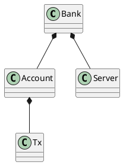

# Portfolio system

| 202307397 | Ali Najafi |
| --------- | ---------- |
| 202207320 | Avantika   |
|           | Adriana    |

## SWAPK

# Introduction
We have chosen to do a Portfolio system for our SWAPK. 

# System description
The banking system has three main features where each feature have set of requirements that needs to be fullfiled. 

#### Features

Feature 1: Account management 
This feature allows users to create accounts and also manage their account. 

Feature 2: Payment and transfer 
This feature enables user to deposit, withdraw and track transaction in their accounts. It also allows the user to view their transaction history and account balance. 

Feature 3: Investment management
This allows the user to manage their invesments, including buying and selling stocks.  

#### Requirements

- F1.1: The system shall allow users to create an account

- F1.2: The system shall allow users to have more than one account

- F1.3: The system shall support switching to another bank

- F2.1: The system shall have deposit funds into their account

- F2.2: The system shall allow users to withdraw funds from their account 

- F2.3: The system shall allow users to check the transaction history 

- F2.4: The system shall allow users to check their current balance

- F3.1: The system shall allow users to buy stocks

- F3.2: The system shall allow users to sell stocks

# Architecture
This is an overall class diagram which represents the main functional components for the portfolio system and their relationships without showing the helper class such as logger. The diagram shows that the system is designed for the user to one or multiple accounts, change betweeen currency and stocks. It illustrates the dependency of account on transaction. 

# Design
# Implementation
# Discussion
# Conclusion